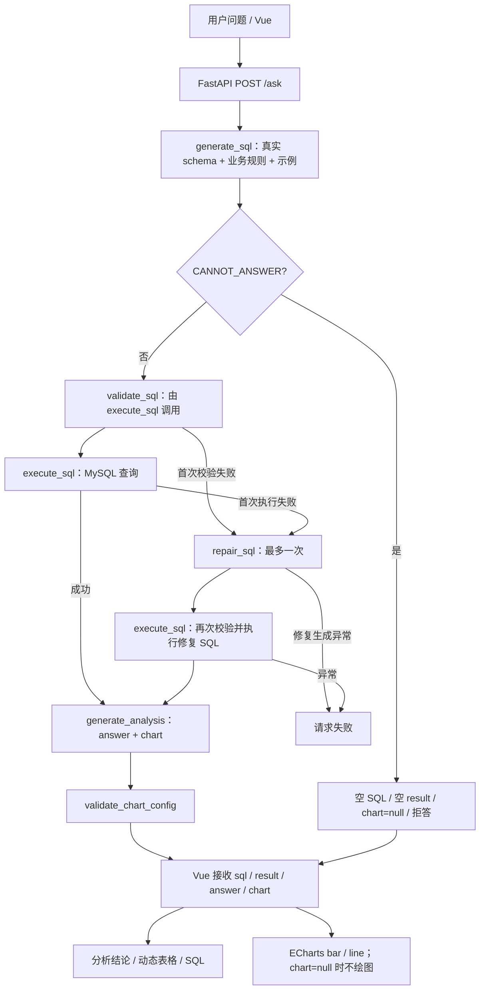
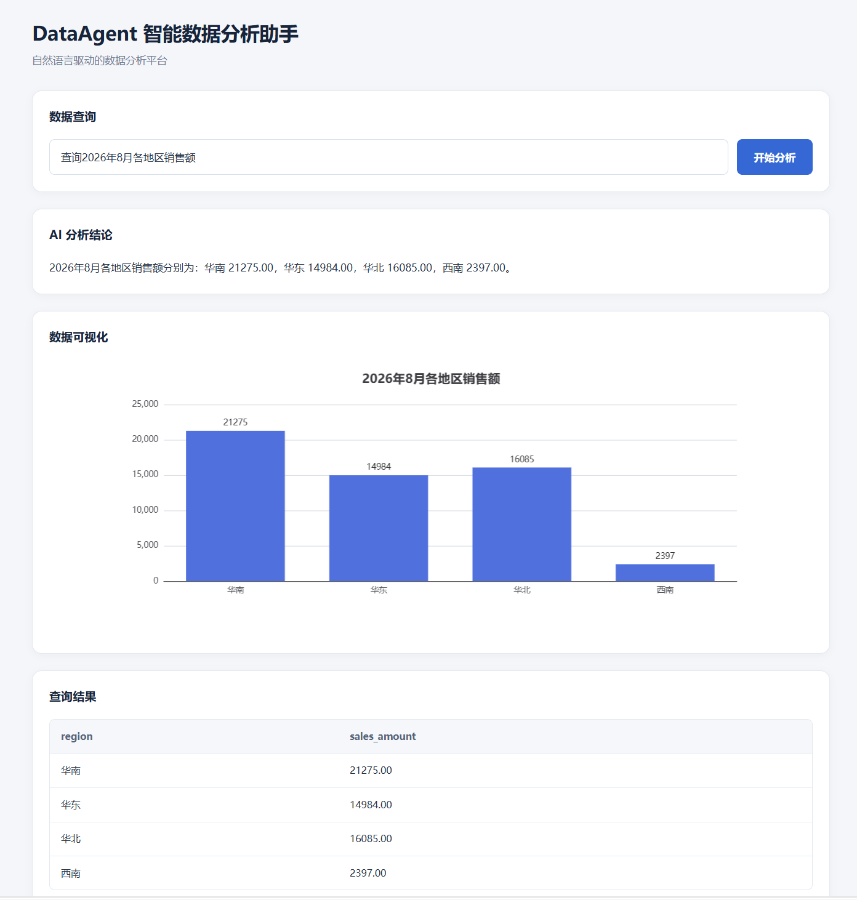
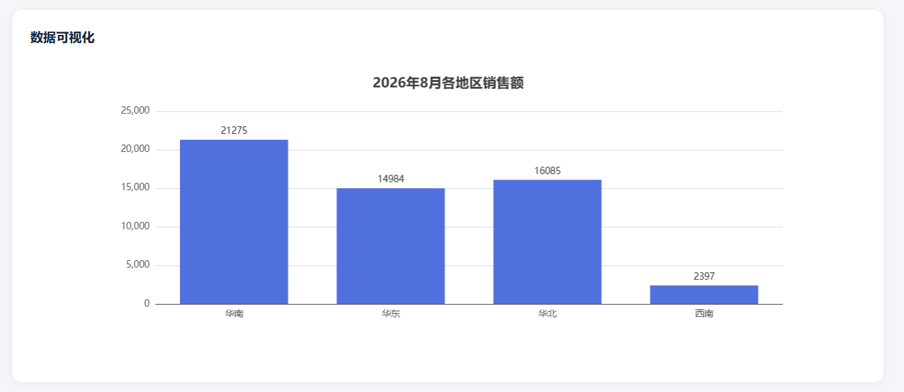
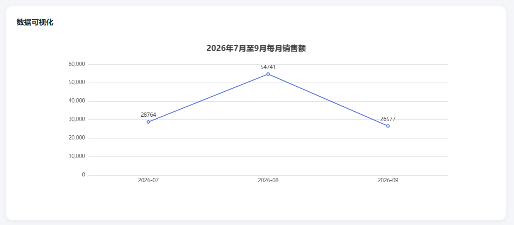
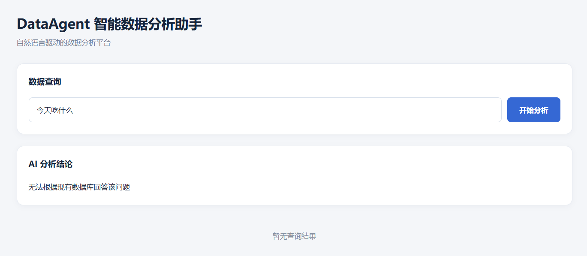

# DataAgent 智能数据分析平台

自然语言查询 → SQL 校验与执行 → 数据分析 → 表格与图表展示。

## 项目简介

DataAgent 面向客户、产品和订单数据分析。用户输入自然语言问题，系统通过 LLM 生成 SQL，进行只读 SQL 校验并查询 MySQL；首次执行失败时尝试自动修复一次，再根据实际结果生成自然语言分析和可视化配置，由 Vue 3 + ECharts 展示。

项目包含前后端完整查询链路、业务规则 Prompt、真实数据库基准、10 条真实 API 回归记录和操作 Runbook。**最新代码真实 `/ask` 回归：10 / 10 PASS（2026-10-03 17:37–17:38，实体标识规则修复后，正式8000服务）。**

典型问题：“查询2026年8月各地区销售额”“查询2026年7月至9月每月销售额”“查询销售额最高的3个产品”。

## 核心功能

| 能力 | 实际实现 |
| --- | --- |
| 自然语言转 SQL | 读取 MySQL 真实表结构，结合业务规则和 few-shot 示例生成 SQL |
| MySQL 查询 | 使用 PyMySQL 执行查询，返回按字段组织的结果 |
| SQLGlot 只读 SQL 校验 | 解析 MySQL SQL，要求单条语句且顶层为 SELECT 或 UNION |
| SQL 自动修复 | 首次校验或执行异常时，将原问题、SQL 和错误交给模型修复一次 |
| 业务规则 Prompt | 销售额 = unit_price × quantity，仅计入 paid 订单 |
| CANNOT_ANSWER | 数据库无法回答的问题进入拒答路径，返回空 SQL、空结果和空图表 |
| 分析与图表配置 | 生成 answer 和 chart 配置，通过 Pydantic 校验结构，再检查图表字段与数值 |
| 动态结果展示 | Vue 动态表格、SQL 代码块、ECharts bar / line；卡片布局和横向滚动 |
| 页面状态 | loading 与按钮禁用、请求错误提示、空结果提示；单指标场景不绘图 |

## 技术栈

| 层次 | 技术 |
| --- | --- |
| Frontend | Vue 3、JavaScript、Vite、普通 CSS |
| Backend | Python、FastAPI、Pydantic、PyMySQL、python-dotenv |
| Database | MySQL；customers、products、orders 三张关联表 |
| LLM | DeepSeek API，通过 OpenAI Python SDK 的兼容接口调用；模型由 DEEPSEEK_MODEL 配置 |
| SQL Parser | SQLGlot（MySQL 方言） |
| Visualization | Apache ECharts，支持柱状图和折线图 |

## 系统流程



正常成功路径只执行一次 SQL，然后生成分析和图表配置。首次校验或执行失败时，最多修复一次；修复后的 SQL 仍通过 `execute_sql` 的校验，修复或再次执行失败则向上抛出，不无限重试。

接口请求体为 `{"question":"查询2026年8月总销售额"}`；响应字段为 `sql`、`result`、`answer`、`chart`。本文所称 chart_config 指图表配置这一职责；真实接口字段名是 `chart`，前端保存在 `chartConfig` 中。

## 核心实现亮点

1. **Text-to-SQL 上下文约束**：`get_database_schema` 读取真实表和列，`get_sql_context` 将其与 `BUSINESS_RULES`、`FEW_SHOT_EXAMPLES` 组合，提供给 `generate_sql`。销售额口径明确为 `products.unit_price * orders.quantity`，只计 `orders.status = 'paid'`。产品/客户实体聚合按唯一 ID 与名称分组，名称用于展示；地区和月份汇总保持其原有聚合粒度。
2. **执行前 SQL 校验**：`validate_sql` 使用 SQLGlot AST 检查语句数量与顶层类型，拒绝多语句及非 SELECT/UNION 顶层语句。其范围是基础只读语句校验，不能替代数据库账户权限或完整 SQL 沙箱。
3. **一次 SQL 自动修复**：`repair_sql` 接收用户原问题、原 SQL 和执行错误，并复用 schema/业务规则上下文。修复 SQL 再次校验与执行；修复后失败向上抛出。
4. **显式拒答路径**：生成阶段输出 `CANNOT_ANSWER` 时，`ask_data_agent` 返回“无法根据现有数据库回答该问题”，避免用虚假 SELECT 回答数据库无关问题。该路径仍需要 schema 读取和模型调用。
5. **分析与渲染分层**：`generate_analysis` 根据实际查询结果生成 answer 与图表配置；`AnalysisOutput`/`ChartConfig` 校验结构，`validate_chart_config` 检查字段和数值。Vue 按配置取数和渲染，不在前端重新推断业务指标。分析 JSON 解析或模型结构校验失败时保留查询结果，返回降级提示。
6. **Baseline + Regression**：9 条基准 SQL 已在真实 MySQL 上采集结果，10 条用户问题通过真实 `/ask` 验证；按语义、数值及图表配置比较，不要求 SQL 字符串完全一致。记录可用于后续 Prompt、SQL 生成和分析逻辑变更后的重复验收。
7. **Runbook**：提供环境变量、启动停止、数据库/API/UI 分层检查、故障排查及实现边界，便于其他人接手运行和定位问题。

销售额按当前产品单价计算；当前表结构没有订单历史成交价字段。项目采用本地开发运行方式，现有鉴权、CORS、超时及图表适配等边界见 [Runbook](docs/runbook.md)。

## 项目截图

### 完整主页面



### 2026年8月各地区销售额



### 2026年7月至9月每月销售额



### 数据库无关问题拒答



## 回归测试

**最新回归：10 / 10 PASS，0 FAIL（2026-10-03 17:37–17:38，正式8000服务真实 POST /ask）。**Case 01–09 对照实际 MySQL 基准；Case 10 验证数据库无关问题的拒答契约。

| 覆盖范围 | 案例 |
| --- | --- |
| 多表 JOIN、paid、日期和地区过滤 | 8月各地区销售额、8月华南销售额 |
| 产品聚合、排序和 LIMIT | 各产品销售额、销售额最高的3个产品 |
| 时间聚合与折线图 | 7–9月每月销售额，按月份升序 |
| 单指标不绘图 | 8月总销售额 |
| COUNT 与客户聚合 | 各地区已支付订单数量、最高消费客户 |
| 空结果与拒答 | 1900年1月各地区销售额、“今天吃什么” |

本轮在重启正式服务后逐条单次执行，Case 01 请求时间 `2026-10-03T17:37:55+08:00`，Case 10 请求时间 `2026-10-03T17:38:27+08:00`。对应 `generate_sql.py` SHA-256：`0d6adeb29db63e6b1e4d03f750d6e043be5f0efb887bd2817e2b5ddc6a63407f`。Case 02/06 按产品 ID 与名称分组，Case 08 按客户 ID 与名称分组；金额、排序和图表配置均通过原有基准验收。以前版本的通过记录不作为本轮结论。

每条记录包含实际 SQL、result、answer、chart、baseline result 和 PASS/FAIL 依据；金额按 Decimal 精确比较，允许等价别名和无排序要求场景的行序差异。本轮未发现数据口径或接口图表配置错误。

该结果代表这10条固定问题的一次真实 API 回归，不代表所有问题都正确；不包含浏览器渲染验收或 repair_sql 故障分支覆盖。回归资料是已执行记录和可重复的人工验收集，未将临时验证脚本加入项目作为正式自动化测试。详细结果以 [regression_cases.md](tests/regression_cases.md) 为准；采集证据描述较早的基准采集阶段。

## 项目结构

```text
data-agent/
├── README.md
├── requirements.txt           # Python 直接依赖及版本
├── main.py                    # FastAPI POST /ask
├── generate_sql.py            # SQL 生成、修复、分析与查询编排
├── db.py                      # MySQL、schema 读取、SQLGlot 校验
├── schemas.py                 # 请求、响应及分析结构模型
├── visualization.py           # 图表配置校验
├── schema.sql                 # 建库、建表与 seed
├── frontend/
│   ├── package.json
│   ├── package-lock.json
│   ├── vite.config.js
│   └── src/
│       ├── main.js
│       ├── App.vue            # 查询、结果、状态与 ECharts
│       └── style.css           # 页面样式
├── docs/
│   ├── runbook.md
│   └── images/                # 项目真实截图
└── tests/
    ├── regression_cases.md
    ├── baseline_queries.sql
    └── baseline_capture.md
```

## 本地运行

### 1. Python 环境与私有配置

将本项目目录作为当前工作目录（下面以 `data-agent` 为例）。`requirements.txt` 仅列出源码直接依赖和启动所需的 uvicorn，版本来自已运行后端的 Python 3.13 环境；未复制共享环境的完整 pip freeze。

Windows / PowerShell：

```powershell
cd data-agent
python -m venv .venv
.\.venv\Scripts\Activate.ps1
python -m pip install -r requirements.txt
```

若系统不允许执行激活脚本，可直接用 `.\.venv\Scripts\python.exe` 代替后续命令中的 `python`。numpy、regex、sympy 当前仍在源码顶层导入，因此也列入依赖。

在项目根目录私下配置 `.env`。以下均为占位符，请替换为自己的配置，不要提交真实密钥或密码：

```dotenv
DB_HOST=127.0.0.1
DB_PORT=3306
DB_USER=your_mysql_user
DB_PASSWORD=your_mysql_password
DB_NAME=data_agent
DEEPSEEK_API_KEY=your_deepseek_api_key
DEEPSEEK_MODEL=your_available_model
```

模型名称按自己账号可用配置填写；代码没有默认模型。已有 `.gitignore` 忽略 `.env`、`.venv/` 和 `venv/`。

### 2. MySQL 数据

确认 MySQL 服务可用，配置用户能够读取目标库以及 customers、products、orders 表。已有数据库直接使用，先参考 Runbook 的只读检查。

首次初始化专用空测试库时，从项目根目录启动 MySQL 客户端；密码在提示符中输入，用户名替换为自己的用户：

```powershell
mysql --host=127.0.0.1 --port=3306 --user=your_mysql_user --password --default-character-set=utf8mb4
```

```sql
source schema.sql
```

`schema.sql` 会创建并选择 `data_agent` 库，包含建表和 INSERT。仅在确认是专用空库且有相应权限时执行，不要重复导入到现有数据库；已有项目数据和基准无需重新初始化。

### 3. FastAPI 后端

在项目根目录、使用上述环境启动：

```powershell
python -m uvicorn main:app --reload --host 127.0.0.1 --port 8000
```

接口为 `POST /ask`，调试页面为 [FastAPI /docs](http://127.0.0.1:8000/docs)。保持后端监听8000，前端当前固定请求该端口。

### 4. Vue 3 前端

另开终端，使用与项目 Vite 版本兼容的 Node.js 环境：

```powershell
cd data-agent
cd frontend
npm ci
npm run dev
```

已有依赖时可跳过 `npm ci`。打开 Vite 输出的 Local 地址，通常为 [http://127.0.0.1:5173/](http://127.0.0.1:5173/)。可用 `npm run build` 验证前端构建；停止服务时在各终端按 Ctrl+C。

## 相关文档

- [Runbook：运行、操作与故障排查](docs/runbook.md)
- [回归案例与真实 API 执行结果](tests/regression_cases.md)
- [Baseline SQL](tests/baseline_queries.sql)
- [数据库基准采集证据](tests/baseline_capture.md)
